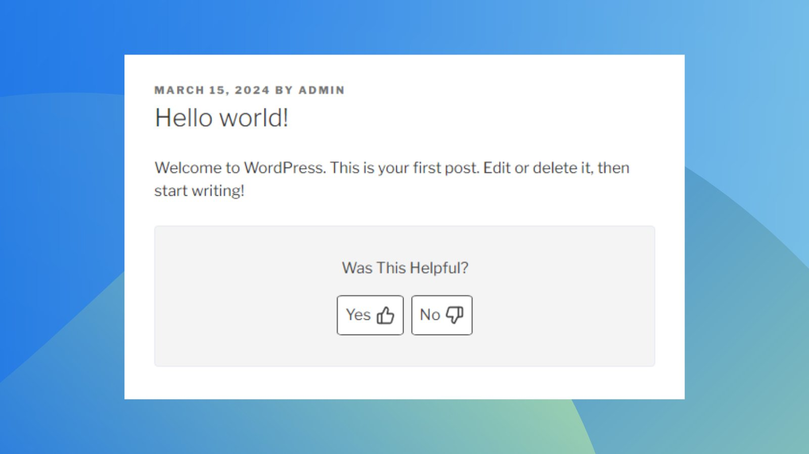

# RI Was This Helpful

  

## Description

**RI Was This Helpful** is a simple WordPress plugin that adds a "Was this helpful?" feedback box at the end of posts and pages. Users can provide feedback using thumb-up/thumb-down buttons.

### Features

- Display a "Was This Helpful" box on posts and pages.
- Choose which post types (posts and pages) the feedback box should appear on.
- Disable the feedback box on specific posts or pages.
- Sort posts and pages by percentage of positive feedback.

## Installation

1. Download the plugin and upload it to the `/wp-content/plugins/riaco-was-this-helpful` directory, or install it directly through the WordPress plugins screen.
2. Activate the plugin through the 'Plugins' screen in WordPress.
3. Go to **Settings -> Was This Helpful** to configure the plugin.

## Usage

Once activated, the plugin automatically adds the feedback box at the end of posts/pages. You can configure its settings via the **Settings -> Was This Helpful** page in the WordPress admin panel.

## FAQ

### Can I choose where the feedback box appears?
Yes, you can enable or disable the feedback box for posts and pages. In the PRO version, you can also display it on custom post types.

### Can I disable the feedback box on specific posts?
Yes, you can disable the feedback box for individual posts or pages using the settings in the post editor.

### How do I view the feedback?
Feedback statistics appear in the admin posts/pages list under a new column **"Was This Helpful"**, showing the percentage of positive feedback and the total number of feedback entries.

### Can I disable the loading of styles or scripts?
Yes, from the plugin settings page, you can disable the loading of styles or scripts if needed.

### How do I enable feedback on custom post types?
With the PRO version, custom post types will be available in the settings. Simply select the ones where you want feedback enabled.

## Changelog

### v2.0.0
- Update: changed prefix
- Update: changed table name
- Update: changed shortcode name

### v1.5.1
- Added shortcode page in the admin menu
- Added option to maintain/delete data when uninstalling

### v1.5.0
- Code refactoring

(For a complete changelog, see the **Changelog** section in the plugin directory.)

## Settings

### Free Version
1. **Show On Post Types**: Enable feedback for posts and pages.
2. **Disable On Specific Posts**: Option to disable the feedback box on individual posts or pages.

### PRO Version
1. **Show On Custom Post Types**: Enable feedback for custom post types.

## Contributing

We welcome contributions! Feel free to submit a pull request or open an issue on GitHub.

## Support

For support, open an issue on GitHub or visit the [plugin support page](https://wordpress.org/support/plugin/ri-was-this-helpful/).

## License

This plugin is licensed under the [GPLv2 or later](https://www.gnu.org/licenses/gpl-2.0.html).

